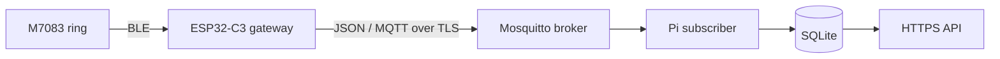

# Smart Ring Gateway architecture

The ESP32-C3 gateway reads the M7083 ring over BLE and publishes decoded readings to MQTT. The Raspberry Pi subscriber in the separate `Smart_Ring_Subs` project validates each message, stores it in SQLite, and serves stored readings through an authenticated HTTPS API. The ring-to-API chain has been verified with real hardware.

## Gateway flow

`main/ble` discovers the configured ring by exact advertised name, optionally filters by BLE address, connects to its GATT services, and receives notifications. `main/protocol` handles COLMI commands and packet decoding; `main/probe` runs the query session. Decoded values use the types in `main/models/RingData.h`, and `main/serialization/RingJson.*` builds each reading's `data` object. `main/main.cpp` adds the version 1 message envelope and publishes through `main/network`.

The gateway synchronizes its clock and connects to Wi-Fi and MQTT before scanning because it has no durable offline queue. A complete history session schedules the next sync for 23 hours later; the last successful sync time is saved in NVS. An incomplete session retries after 10 seconds. Each session queries battery, device information, heart-rate history, HRV history, sleep, SpO₂ history, and live heart rate and SpO₂.

The gateway publishes one JSON record per MQTT message on the configured topic (`gateway/readings` by default), with QoS 1 and no retention. Supported `kind` values are `heartRate`, `spo2`, `heartRateHistory`, `hrvHistory`, `spo2History`, and `sleep`. History from a multi-day response is published one day or night per message. The example envelopes are in [payloadExample.json](../main/models/payloadExample.json); the validation and storage rules are in the subscriber's `docs/message-contract.md`.

Live records get a new 32-character ID for each measurement. Historical records get a stable 16-character ID derived from device ID, kind, and measurement day so later syncs can update that day's record. `observedAt` is the gateway's publish time, including for history. Ring history dates are anchored to the gateway's probe date; they are not independently verified ring timestamps.

## Delivery boundary

A gateway MQTT acknowledgement confirms delivery to the broker, not storage in SQLite. The subscriber acknowledges a valid MQTT message after its database transaction and treats identical record IDs as duplicates; changed historical records can replace earlier versions. There is no gateway flash queue or database-level acknowledgement, so an outage can still lose readings. The subscriber currently validates payload structure but does not verify the claimed device, gateway, and user relationship.

Configuration and capture instructions for the gateway are in [the M7083 guide](m7083-probe.md). The broker and Raspberry Pi service are configured outside this repository.
