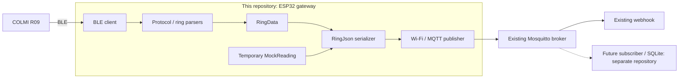

# Smart Ring Gateway: ESP32 architecture

Status: initial design with mock publishing implemented. Real BLE decoding is
still stubbed. Hardware publishing to the existing broker remains to be verified.

## Repository boundary

This repository contains the ESP32-C3 gateway firmware. Its responsibility ends
at publishing JSON to the existing MQTT broker.

| Part | Location / responsibility |
| --- | --- |
| Gateway | This repository: BLE communication, decoding, data types, JSON, Wi-Fi, MQTT publishing |
| MQTT infrastructure | Existing Mosquitto server and webhook, configured separately |
| Storage backend | Future separate repository: MQTT subscriber and SQLite on the Raspberry Pi |

The current setup has one user, one owned COLMI R09 ring, one ESP32-C3 Super Mini,
and an existing Mosquitto server on the home network. Keep device, gateway, and
user identities separate so additional devices/users can be supported later.
The second device is undecided; its integration is future work.

## Data flow

For now, the source is `MockReading`, bypassing BLE and the ring parsers. The
mock type lives in `main/models/MockData.h`; real reading placeholders stay in
`main/models/RingData.h`. The publisher sends a version 1 heart-rate record with
`recordId`, `observedAt`, and `data.bpm`. Configure the existing
infrastructure to receive it using [the MQTT publishing instructions](mqtt-publishing.md).

## Firmware responsibilities

| Component | Responsibility |
| --- | --- |
| `main/main.cpp` | Configure and connect the gateway, then publish the mock reading periodically |
| `main/ble` | Discover/connect to the ring, write GATT commands, receive notifications |
| `main/protocol` | Check/decode packets and produce reading types |
| `main/models` | Decoded data and identity values; current mock has a heart-rate value |
| `main/serialization` | Convert data into JSON using `nlohmann/json` |
| `main/network` | Connect to Wi-Fi and publish to the configured MQTT broker |

Keep COLMI commands, GATT UUIDs, and packet layouts inside the protocol integration.
Keep JSON conversion out of the BLE client and parsers. Preserve source device
identity rather than assuming the gateway always has one device or one owner.
Use separate state for each device when support for another device is added.

The BLE stub accepts a registered device ID and a notification callback with
caller context. The protocol decoder exposes a `DecodedColmiPacket` output
placeholder.
These operations still return `ESP_ERR_NOT_SUPPORTED`; packet fields and BLE peer
mapping will follow discovery. Callers must check for `ESP_OK` before using outputs.

## BLE discovery and the real upload format

Compare the protocol references in the README with captures from the actual R09.
Confirm supported readings, notification/history layouts, fragmentation, timestamp
semantics, history retention, and how to recognize the registered ring reliably.

The real JSON contract waits until this data is understood. The mock heart-rate
record is a temporary publishing test.
Measurement fields, record shapes, batching, and duplicate identity remain undecided.
Future backend ownership checks belong to the separate subscriber project.

## Connectivity and delivery

The ESP32 connects through the home Wi-Fi network to the existing broker; it does
not need a BLE link to the Pi. Measure ring-to-gateway BLE range and Wi-Fi access
separately. A brief hallway visit may not be long enough for a complete ring sync;
verify this against actual history transfer time and retention.

The current mock uses MQTT QoS 1 without retention. It retries connection failures
on the next publish cycle. A broker acknowledgement confirms MQTT delivery to the
broker, not webhook processing or database storage. The gateway currently has no
durable offline queue or application commit-acknowledgement subscription.

Match broker URI, credentials, TLS trust, and topic permissions to the existing
Mosquitto deployment. Broker/webhook deployment is managed outside this repository.

## Next steps

1. Configure the ESP32 for the existing broker and allow its publish topic.
2. Flash the gateway and confirm the mock payload arrives through the existing webhook.
3. Capture and decode actual BLE data, then define the real reading/upload formats.
4. Replace the mock source with decoded readings while retaining device identity.

Later, create a separate MQTT subscriber/SQLite repository for the Raspberry Pi.
The 20-year archive goal, capacity measurement, REST access, and cloud backup
planning belong there. Investigate cloud backup after daily rolling data is working.
