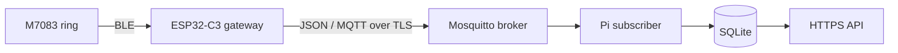

# Smart Ring Gateway architecture

The ESP32-C3 gateway reads the M7083 ring over BLE and publishes decoded readings to MQTT. The Raspberry Pi subscriber in the separate `Smart_Ring_Subs` project validates each message, stores it in SQLite, and serves stored readings through an authenticated HTTPS API. The ring-to-API chain has been verified with real hardware.

| Link | Address or port | Protocol and responsibility |
| --- | --- | --- |
| M7083 ring to ESP32-C3 | Local BLE GATT connection; ring selected by advertised name and optional address | The physical ring provides sensor readings. BLE GATT is required by the ring and suits a battery-powered device. This link is not encrypted by the gateway. |
| ESP32-C3 to broker | Configured URI; default `mqtts://mqtt.saxedesign.se:8883` | Publish one JSON reading per MQTT message over TCP/TLS. Default topic: `gateway/readings`; QoS 1, retained messages disabled. MQTT decouples the gateway from the storage and API processes and allows multiple publishers or subscribers. |
| Broker to Pi subscriber | Same broker hostname and port, same topic | Subscribe with MQTT/TLS and QoS 1. Validate each message, then store it in SQLite. |
| API client to Pi | `https://mqtt.saxedesign.se:8080/readings` in this deployment | HTTPS GET with a bearer token retrieves stored JSON readings. |

Wi-Fi assigns the gateway its local IP address, which appears in the serial log. The Raspberry Pi is the broker, subscriber, database, and API host in this deployment; only broker port `8883` and API port `8080` are exposed externally according to the deployment described in the project draft.

## Gateway flow

`main/ble` discovers the configured ring by exact advertised name, optionally filters by BLE address, connects to its GATT services, and receives notifications. `main/protocol` handles COLMI commands and packet decoding; `main/probe` runs the query session. Decoded values use the types in `main/models/RingData.h`, and `main/serialization/RingJson.*` builds each reading's `data` object. `main/main.cpp` adds the version 1 message envelope and publishes through `main/network`.

The gateway synchronizes its clock and connects to Wi-Fi and MQTT before scanning because it has no durable offline queue. A complete history session schedules the next sync for 23 hours later; the last successful sync time is saved in NVS. An incomplete session retries after 10 seconds. Each session queries battery, device information, heart-rate history, HRV history, sleep, SpO₂ history, and live heart rate and SpO₂.

The Wi-Fi manager retries a disconnect up to five times per connection attempt, and the main loop attempts again after a failed sync. The MQTT client reconnects after a disconnect. A publish waits up to 10 seconds for the broker's QoS 1 acknowledgement. BLE communication errors, malformed packets, missing notifications, or failed publication make a history sync incomplete and trigger another attempt when the ring is nearby.

The gateway publishes one JSON record per MQTT message on the configured topic (`gateway/readings` by default), with QoS 1 and no retention. Supported `kind` values are `heartRate`, `spo2`, `heartRateHistory`, `hrvHistory`, `spo2History`, and `sleep`. History from a multi-day response is published one day or night per message. The example envelopes are in [payloadExample.json](../main/models/payloadExample.json); the validation and storage rules are in the subscriber's `docs/message-contract.md`.

Live records get a new 32-character ID for each measurement. Historical records get a stable 16-character ID derived from device ID, kind, and measurement day so later syncs can update that day's record. `observedAt` is the gateway's publish time, including for history. Ring history dates are anchored to the gateway's probe date; they are not independently verified ring timestamps.

## Logging and monitoring

The ESP32 serial monitor logs Wi-Fi connection and disconnect events, clock synchronization, broker connection and acknowledgement, BLE transmit/receive activity, per-query results, and publish failures. Each probe ends with `PROBE SUMMARY` lines containing packet and byte counts per query plus `lost_notifications`. The last successful sync time in NVS controls the 23-hour schedule. On the Pi, the subscriber logs subscription, stored, updated, duplicate, rejected, and database-error events; the API logs HTTP requests and database read failures. These logs and probe counts are the project's basic operational monitoring. There is no separate metrics endpoint or dashboard.

## Delivery boundary

A gateway MQTT acknowledgement confirms delivery to the broker, not storage in SQLite. The subscriber acknowledges a valid MQTT message after its database transaction and treats identical record IDs as duplicates; changed historical records can replace earlier versions. There is no gateway flash queue or database-level acknowledgement, so an outage can still lose readings. The subscriber currently validates payload structure but does not verify the claimed device, gateway, and user relationship.

Configuration and capture instructions for the gateway are in [the M7083 guide](m7083-probe.md). The broker and Raspberry Pi service are configured outside this repository.
